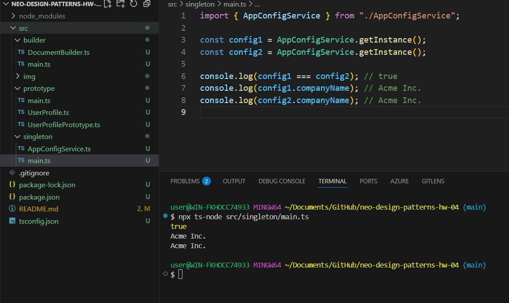
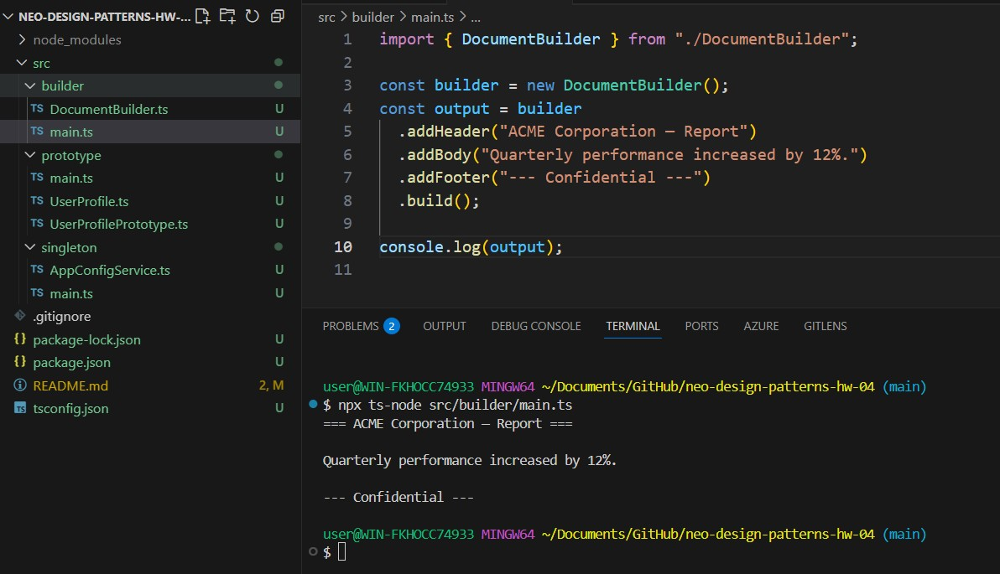
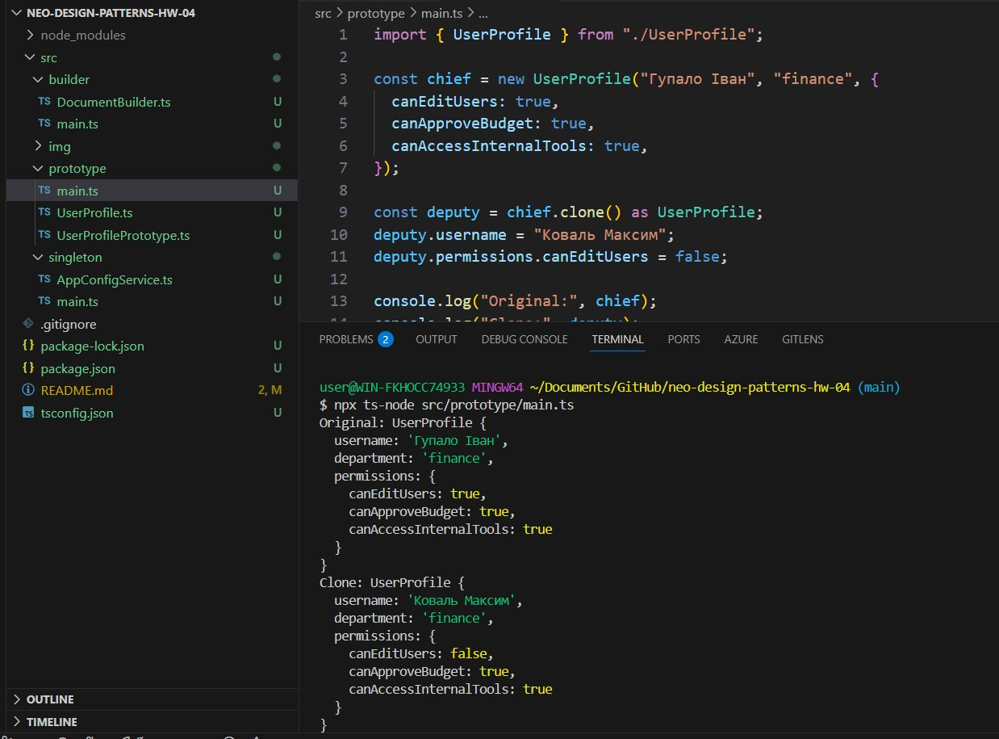

# Домашнє завдання до Теми 4

### Опис завдання

У цьому домашньому завданні необхідно опрацювати три окремі приклади застосування породжувальних патернів: Одинак, Будівельник та Прототип.

Кожен приклад подано як реалістичну задачу з практичного TypeScript-контексту. Ваше завдання — проаналізувати початковий код та застосувати відповідний патерн, переписавши реалізацію.

## Структура проєкту

src/
├── builder/ # Builder pattern implementation
│ ├── DocumentBuilder.ts
│ └── main.ts
├── prototype/ # Prototype pattern implementation
│ └── UserProfile.ts
│ └── UserProfilePrototype.ts
│ └── main.ts
└── singleton/ # Singleton pattern implementation
│ └── AppConfigService.ts
│ └── main.ts

## Запуск

1. Встановити залежності:

npm install

2. Запустити:

npx ts-node src/singleton/main.ts
npx ts-node src/builder/main.ts
npx ts-node src/prototype/main.ts

3. Вивід у терміналі:

1) singleton

2. builder

3. prototype

